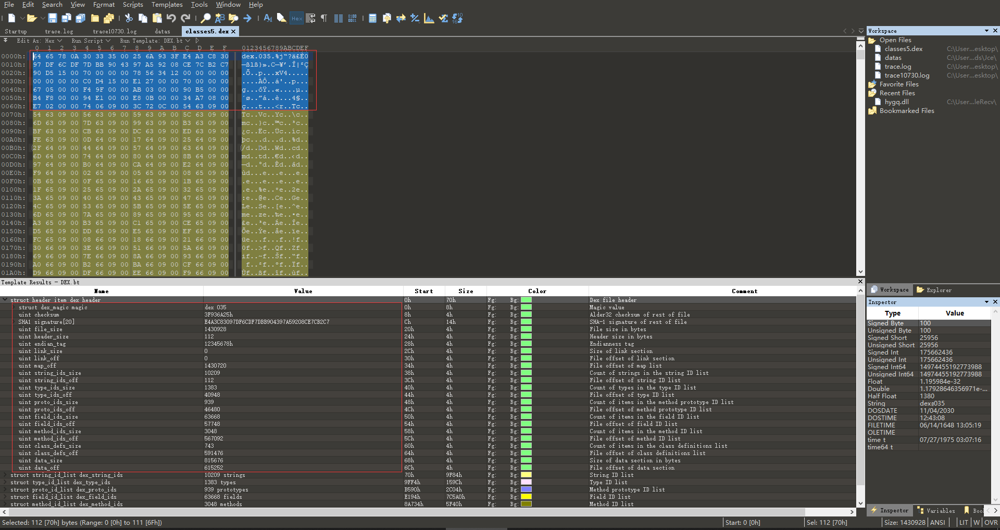
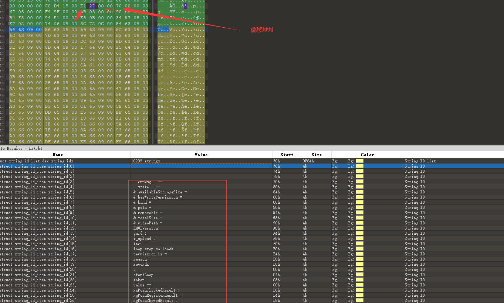
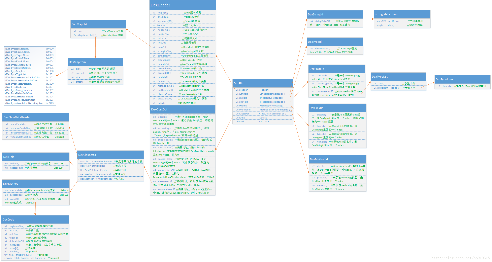

### 安卓dex文件解析

Dex文件是手机上类似Windows上的EXE文件，dex文件是可以直接在Dalvik虚拟机中加载运行的文件。

随便取一个dex。拖进010editor中查看



其实可以很清晰的看到一些结构体，这是因为010有个插件的原因。

直接看安卓源码

```c++
/*
 * Direct-mapped "header_item" struct.
 */
struct DexHeader {
    u1  magic[8];                        // dex版本标志 dex的魔数 一般都是固定的dex.035 
    u4  checksum;                        // alder32校验
    u1  signature[kSHA1DigestLen];       // SHA-1哈希值
    u4  fileSize;                        // 整个文件大小
    u4  headerSize;                      // DexHeader结构大小
    u4  endianTag;                       // 字符序标记
    u4  linkSize;                        // 链接段大小
    u4  linkOff;                         // 链接段偏移
    u4  mapOff;                          // DexMapList的文件偏移
    u4  stringIdsSize;                   // DexStringid的个数
    u4  stringIdsOff;                    // DexString的文件偏移
    u4  typeIdsSize;                     // DexTypeid的个数
    u4  typeIdsOff;                      // DexTypeid的文件偏移
    u4  protoIdsSize;                    // DexProtoid的个数
    u4  protoIdsOff;                     // DexProtoid的文件偏移
    u4  fieldIdsSize;                    // DexFieldid的个数
    u4  fieldIdsOff;                     // DexFieldid的文件偏移
    u4  methodIdsSize;                   // DexMethodid的个数
    u4  methodIdsOff;                    // DexMethodid的文件偏移
    u4  classDefsSize;                   // DexClassDef的个数
    u4  classDefsOff;                    // DexClassDef的文件偏移
    u4  dataSize;                        // 数据段的大小
    u4  dataOff;                         // 数据段的文件偏移
};
```

这里都包含了一些字段的定义

在继续往下看，能看到一些string，field，maps的定义以及偏移地址



这些字段就不分析了，我这里只是做个记录，以下这些pdf比我分析的更清楚。




https://bbs.pediy.com/thread-184761.htm

 [实例分析dex 文件格式-20140323.pdf](实例分析dex 文件格式-20140323.pdf) 

